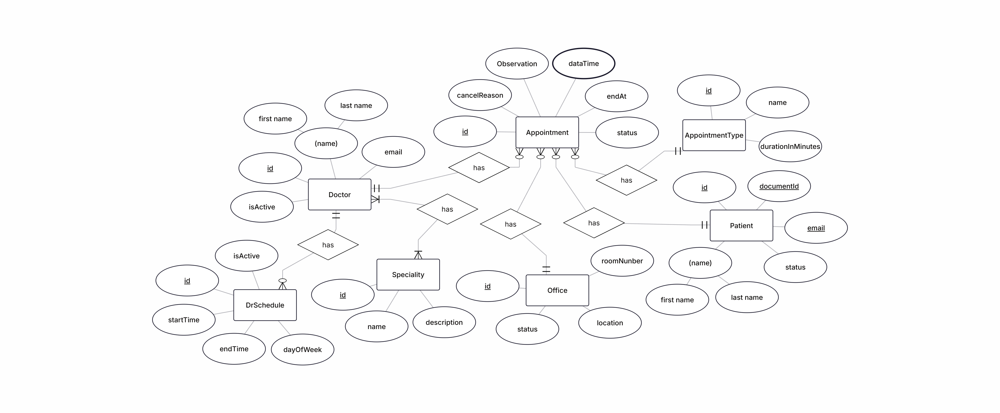

# RCMU - Reservas de Consultorios Médicos Universitarios

RCMU es una solución de backend robusta diseñada para la gestión integral de servicios médicos, incluyendo el control de citas, disponibilidad de consultorios y administración de personal facultativo. El sistema destaca por su enfoque en la integridad de datos y el cumplimiento estricto de reglas de negocio mediante pruebas automatizadas.

## Arquitectura y Diseño Técnico

El proyecto implementa una **Arquitectura Multicapa**, garantizando el desacoplamiento y la escalabilidad del sistema:

* **Capa de Servicio (Business Logic):** Implementación de las reglas de negocio críticas.
* **Capa de Persistencia (Repositories):** Abstracción de acceso a datos mediante Spring Data JPA.
* **Modelo de Dominio (Entities/DTOs):** Uso de **Java Records** para la transferencia de datos (Requests/Responses), asegurando la inmutabilidad de los objetos en tránsito.
* **Mappers:** Componentes dedicados para la conversión entre entidades JPA y DTOs, evitando la exposición del modelo relacional.

### Modelo de Datos (Diagrama Entidad-Relación)

> **Nota:** El diagrama anterior detalla la relación entre Pacientes, Doctores y Consultorios, así como la gestión de estados que soporta las reglas de negocio.

## Reglas de Negocio e Integridad

Para asegurar la operatividad de la clínica, el sistema valida automáticamente:

### Gestión de Agendamiento
1.  **Validación Temporal:** Bloqueo estricto de registros en fechas u horarios pasados.
2.  **Traslape de Facultativos:** Un profesional de la salud no puede tener colisiones de horario entre múltiples citas.
3.  **Disponibilidad Física:** Validación de concurrencia en consultorios para evitar la asignación simultánea de un mismo espacio físico.

### Estados de Entidad
* **Pacientes:** Solo se permite el agendamiento a usuarios con estado `ACTIVE`.
* **Consultorios:** La asignación está restringida a espacios con estado `AVAILABLE`.
* **Doctores:** Validación de estado operativo antes de la asignación de turnos.

## Estrategia de Testing

El proyecto sigue principios de **Test-Driven Development (TDD)** para el núcleo de la lógica:

* **Pruebas Unitarias:** Enfoque prioritario en `AppointmentServiceImpl` utilizando **Mockito** para el aislamiento de dependencias.
* **Validaciones Críticas:** Pruebas automatizadas para escenarios de traslape, lógica de estados y validaciones cronológicas.
* **Pruebas de Integración:** Verificación de la capa de persistencia (Repositories) para asegurar la consistencia de las consultas JPQL y criterios de búsqueda.

## Especificaciones Técnicas

* **Lenguaje:** Java 21
* **Framework:** Spring Boot 4
* **Gestor de Dependencias:** Maven
* **Base de Datos:** PostgreSQL / H2 (In-memory para pruebas)
* **Otros:** Testcontainers, JUnit5, Mockito

